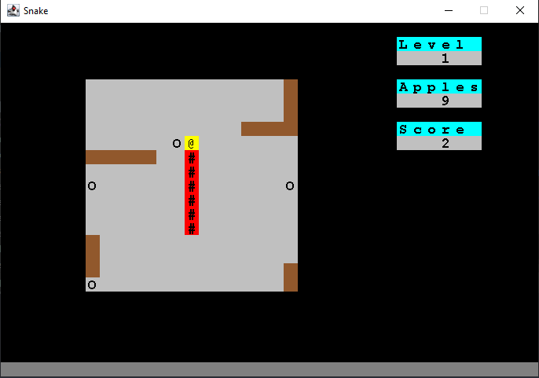
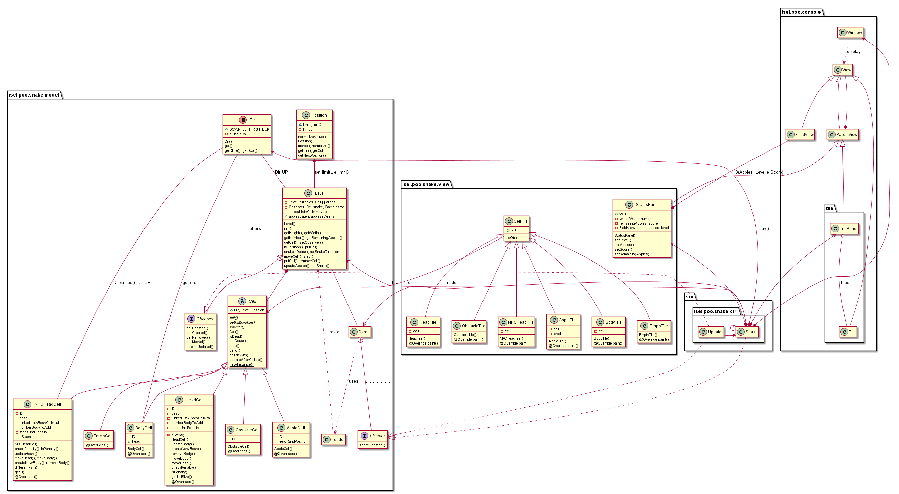

## Snake Game
- Old project with no build automation tool (like Gradle)
- The `ConsolePG.jar` is the library that was provided to  easily draw content to the screen
- In IntelliJ, go to Project Structure -> Libraries -> Add the library `ConsolePG.jar`
## Preview
</img>

## Code structure
</img>

## Compiling into .jar
### Option 1 - Using IntelliJ
1. https://www.jetbrains.com/help/idea/compiling-applications.html#package_into_jar
2. If the ConsolePG.jar was added into the Project, there's no need to explicitly add it in the artifact
3. The config will be at `.idea/artifacts/Snake_Game_Artifact_jar.xml`
4. The artifact `Snake_Game_Artifact_Final` just includes the copy of the levels.txt

### Option 2 - Using Command line
1. Since using the wildcard '*' only searches in 1 directory and doesn't perform a recursive search, the Single Argument File option should be used. So we need to generate a file that lists all the .java files as the list of arguments to pass to the java compiler.
   1. Linux (Bash) -> find -name "*.java" > sources.txt
   2. Windows (in Command Line aka Command Prompt, not PowerShell (used by default in IntelliJ)) -> dir /s /B .\src\isel\poo\*.java > sources.txt
2. javac -d ./build @sources.txt -cp ConsolePG.jar
3. Make sure you have a META-INF folder inside src/. It should have a MANIFEST.MF file with:
```
Manifest-Version: 1.0
Main-Class: isel.poo.snake.ctrl.Snake
```
Creating the artifact through IntelliJ interface automatically creates this file.

4. cd build && jar xf ..\ConsolePG.jar && cd .. // extract the contents of the .jar file to the build directory
5. jar cfm .\out\artifacts\Snake-Game-Manual.jar .\src\META-INF\MANIFEST.MF -C ConsolePG.jar . -C .\build . //cfm -> create a JAR file, m -> merge manifest, f -> output to file (not standard output)
6. copy levels.txt .\out\artifacts\

## Running
- java -jar out/artifacts/Snake_Game_Artifact_jar/Snake-Game-Artifact.jar //Option 1
- java -jar out/artifacts/Snake-Game-Manual.jar //Option 2

> [!NOTE]
> In the examples, I'm using the format of specifying file locations as in Windows by mostly using '\', in Linux forward slash should be used '/' 
## Trivia
Done in group with Tiago Cardoso
- https://docs.oracle.com/javase/8/docs/technotes/tools/windows/javac.html
- https://docs.oracle.com/javase/tutorial/deployment/jar/build.html
- https://docs.oracle.com/javase/tutorial/deployment/jar/modman.html
- https://docs.oracle.com/javase/tutorial/deployment/jar/unpack.html